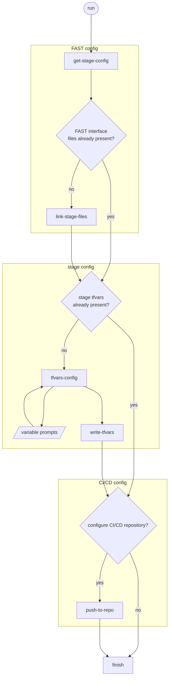

# FAST configurator

<!-- # https://mermaid-js.github.io/mermaid/#/flowchart?id=graph
 -->

```mermaid
flowchart TB
  main([run])
  check-stage-files{FAST interface\nfiles already present?}
  check-tfvars{stage tfvars\nalready present?}
  prompt-cicd{configure CI/CD repository?}
  prompts[/variable prompts/]
  main--->get-stage-config
  subgraph FAST config
  direction LR
  get-stage-config--->check-stage-files
  check-stage-files--->|no|link-stage-files
  end
  subgraph stage config
  direction LR
  check-stage-files--->|yes|check-tfvars
  link-stage-files--->check-tfvars
  check-tfvars--->|no|tfvars-config
  tfvars-config--->prompts
  prompts--->tfvars-config
  tfvars-config--->write-tfvars
  end
  subgraph CI/CD config
  direction LR
  check-tfvars--->|yes|prompt-cicd
  write-tfvars--->prompt-cicd
  prompt-cicd--->|yes|push-to-repo
  end
  prompt-cicd--->|no|finish
  push-to-repo--->finish
```
